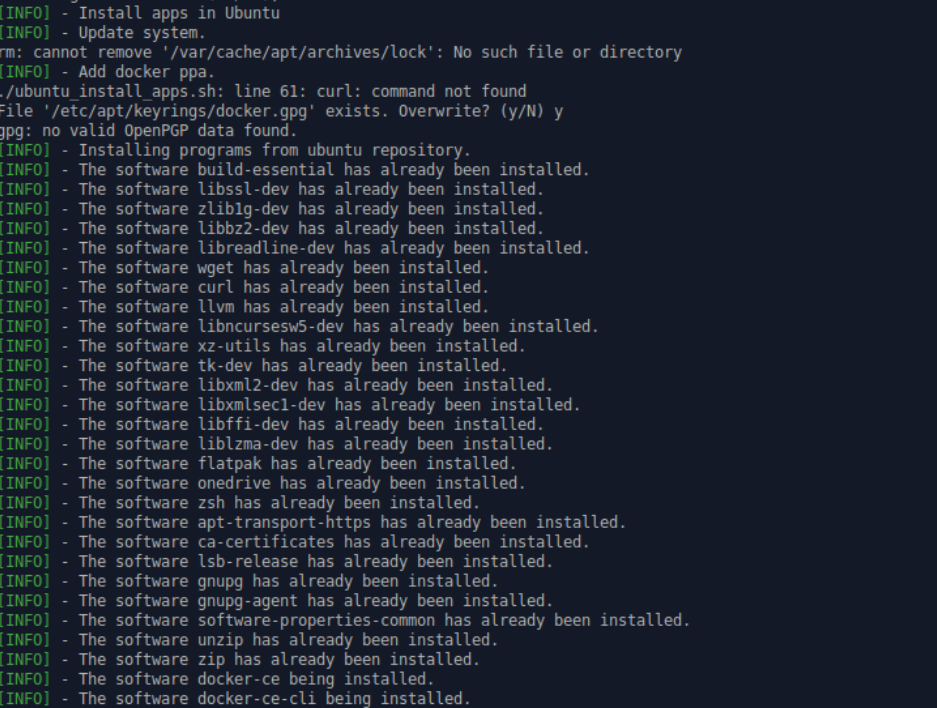

<h3 align="center">
  Program installation script automation
</h3>

## Why ?
Because I'm getting old :older_man: and I need to automate tasks that are getting repetitive. :blush:
It script works in Ubuntu and Fedora.



```bash
git clone https://github.com/Claudio-code/program-installation-script-automation.git && cd ./program-installation-script-automation && ./startup.sh
```